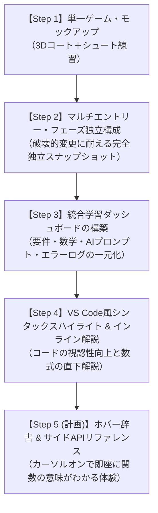

# 📜 学習システム & ダッシュボード発展の軌跡 (Dashboard Evolution Log)

このドキュメントは、教材用Web 3Dゲーム開発スタジオにおいて、**「生徒がコードやゲーム構造を学ぶためのインターフェースが、どのような思考プロセスと課題意識を経て段階的に発展していったか」** を記録した教育開発メモです。

---

## 📈 発展のロードマップとタイムライン

---

## 📑 各段階の背景・導入理由・得られた学び

### 1. 【Step 1】単一の3Dゲームプロトタイプ
* **状態:** `index.html` と `src/` によるシンプルな Three.js ゲーム。
* **課題:** ゲームがバージョンアップ（Phase 2, Phase 3...）するにつれて、過去のシンプルな状態（Phase 1: ソロ練習）を生徒が体験できなくなる問題。

### 2. 【Step 2】マルチエントリー・フェーズ独立スナップショット (`phases/`)
* **導入の背景:**
  * 「最新コード内に `if (phase === 1)` のような分岐を残す」方法では、将来の物理エンジン導入や大規模リファクタリング時に過去コードが壊れてしまう懸念があった。
* **解決策:**
  * 各フェーズ完了時のコード一式を `phases/phase_XX/` 配下に完全スタンドアロンで保管。
  * ルートに目次ポータル（`index.html`）を置き、Vite マルチページでサーバー1つから全フェーズを起動可能にした。
* **生徒・教材へのメリット:** 将来どんな大改修があっても、過去のフェーズが永久に100%動き続ける。

### 3. 【Step 3】統合学習ダッシュボード (`dashboard/`) の構築
* **導入の背景:**
  * 単にゲームを動かすだけでなく、「要件定義」「設計判断(ADR)」「数学・物理の数式」「AIへのプロンプト指示方法」「過去のエラーログ」を同じ世界観（UI）で学べるハブが必要となった。
* **解決策:**
  * フェーズ選択に連動して6つのタブ（概要、コード、数学、AI指示ガイド、トラブル、ライブプレイ）を動的に切り替えるダッシュボードを開発。

### 4. 【Step 4】VS Code 風シンタックスハイライト & インライン解説
* **導入の背景:**
  * 生のJavaScriptテキストでは初学者がコードの構造を把握しづらく、数式の意味が直感的に伝わらなかった。
* **解決策:**
  * 軽量シンタックスハイライター（予約語・型・文字列・コメント・数値の色分け）を実装。
  * 重要なコード（斜方投射、ベクトルの内分点・内積、ステートマシン）の直下に「💡 インライン解説カード」を展開。
  * クイックジャンプ目次と、解説モード（ON/OFF）切替を統合。

### 5. 【Step 5 (計画・進行中)】ホバー・ポップアップ辞書 & 重要APIリファレンス
* **目指す姿:**
  * コード上の関数名（`normalize()`, `dot()`, `sub()` 等）にカーソルを乗せるだけで、役割と使い方が即座にポップアップ。
  * サイドバーで「このファイルで使われている主要API一覧」を逆引きできるようにする。

---

## 💡 教材設計における重要原則
1. **「触ればわかる」フィードバックの即時性**:
   - 難しい専門用語を別ページで調べさせるのではなく、コードそのものに解説を紐付ける。
2. **段階的な機能追加（競合・複雑化の防止）**:
   - 1つの機能（ホバー辞書）が完成して安定してから、次の機能（APIリファレンス等）を重ねる。
