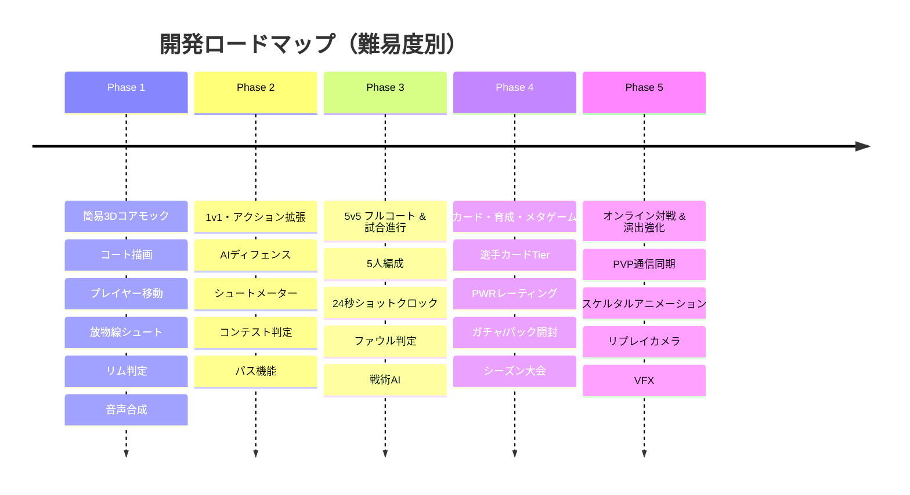

# 🎯 3Dバスケットボールゲーム 段階的要件定義書

『NBA 2K Mobile』のような本格3Dゲームを初心者が一気に作るのは難易度が高すぎるため、**「動くものを小さく作り、段階的に肉付けしていく（アジャイル開発）」** 手法をとります。

---

## 難易度別 5段階ロードマップ

---

## 各フェーズの詳細要件

### Phase 1: 簡易3Dコアモック（難易度: ★☆☆☆☆）※完了
* **目的:** 3D空間でプレイヤーを動かし、ボールを投げてリングに入れるという最も根幹の「楽しさ（コアゲームループ）」を検証する。
* **主要機能:**
  * 3Dハーフコート & ゴール（Three.js）
  * プレイヤー移動 & ドリブルアニメーション同期
  * 放物線シュート物理 & スウィッシュ/リム衝突判定
  * Web Audio API 効果音
  * PC/モバイル両対応操作

### Phase 2: 1v1 & アクション拡張（難易度: ★★☆☆☆）
* **目的:** 「対戦相手がいる駆け引き」と「チームプレイの基礎」を導入する。
* **主要機能:**
  * 追従＆間合いをとる敵AIディフェンダー
  * ディフェンスの距離に応じたシュート成功率変化（Open / Contested）
  * ブロックショット & スティール判定
  * 味方プレイヤーへのパス機能

### Phase 3: 5v5 フルコート & ルール進行（難易度: ★★★☆☆）
* **目的:** 本格的なバスケットボールの試合ルールとチーム戦術を実装する。
* **主要機能:**
  * 5人（PG, SG, SF, PF, C）のポジション配置
  * 24秒ショットクロック、8秒バックコート、ファウル、フリースロー
  * オフェンス戦術（ピック＆ロール、アイソレーション、速攻）

### Phase 4: カード・育成・ロスター編成（難易度: ★★★★☆）
* **目的:** 継続して遊びたくなるソーシャルゲーム・RPG要素（メタループ）を構築する。
* **主要機能:**
  * 選手カード（ブロンズ、シルバー、ゴールド、エメラルド、ダイヤモンド等）
  * PWR（戦力値）レーティング & バッジスキル
  * ガチャ/パック開封演出、シーズンモード（トーナメント大会）

### Phase 5: オンライン対戦 & 演出強化（難易度: ★★★★★）
* **目的:** 他のプレイヤーとのリアルタイム対戦と、据え置きゲーム並みの演出クオリティを実現する。
* **主要機能:**
  * WebSocket / WebRTC によるリアルタイム対戦同期
  * モーションキャプチャ由来の滑らかなスケルタルアニメーション
  * スローモーションリプレイ、歓声、実況テキスト
