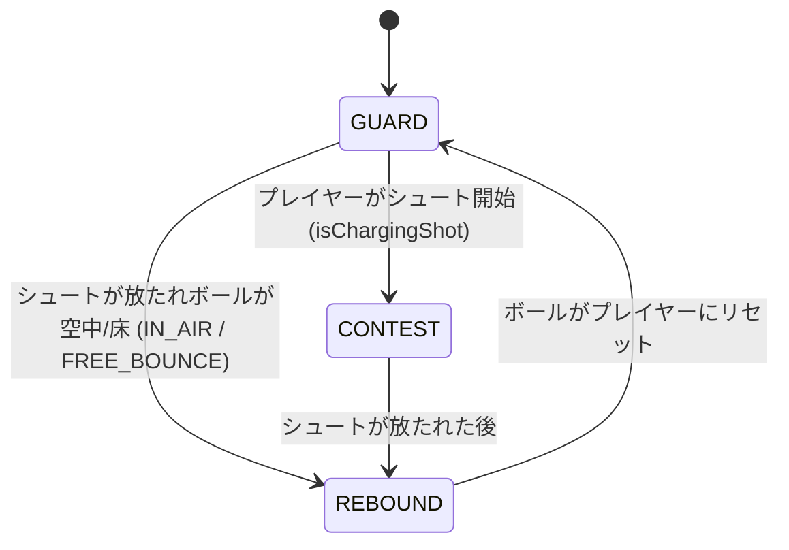

# 🛡️ 1v1 AIディフェンダー & コンテスト・ブロック機構 (AI Defender Architecture)

このドキュメントでは、『HOOPS 3D』における **1v1 AIディフェンダーの思考ロジック（ポジショニング）** および **シュートコンテスト・ブロック判定の数学的アルゴリズム** を解説します。

---

## 1. 🧠 AI ディフェンダーのステートマシン (State Machine)

AIディフェンダーは、状況に応じて以下の4つの状態を遷移しながら行動します。



### 各状態の挙動
1. **`GUARD`（マーク中）:**
   - バスケットボールの基本原則である **「ボールマン（プレイヤー）とゴールの間に入る」** ように自動ポジショニング。
   - プレイヤーがドリブルで移動すると、スライドステップで追従します。
2. **`CONTEST`（シュート妨害・ブロック）:**
   - プレイヤーがシュートモーションに入ると、人間の反射神経を模した「反応遅延（Reaction Delay: 約0.12秒）」の後に両手を高く掲げてジャンプブロックを試みます。
3. **`REBOUND`（ルーズボール・リバウンド回収）:**
   - シュートが外れたりブロックされた場合、床でバウンドしているボールに向かって移動します。

---

## 2. 📐 ポジショニングの幾何学（ベクトルの内分点）

ディフェンダーが「常にプレイヤーとゴールの間に回り込む」ための目標座標は、ベクトル演算によって求められます。

```
[ゴール (Hoop)] (0, 3.05, -5.25)
       ^
       |
       |  toHoop ベクトル（正規化）
       |
 [Defender目標位置] = PlayerPos + toHoop * cushionDistance
       ^
       |  cushionDistance (約 1.65m)
       |
 [Player (ボールマン)] (x, 0, z)
```

```javascript
// プレイヤーからゴールへ向かう単位ベクトル
const toHoop = hoopPosition.clone().sub(player.position).setY(0).normalize();

// プレイヤーからゴール方向にクッション距離（約1.65m）進んだ位置
const targetGuardPos = player.position.clone().addScaledVector(toHoop, guardDistance);

// ディフェンダーを目標位置へ向かってスムーズに移動
this.position.addScaledVector(moveDirection, speed * delta);
```

> [!TIP]
> **ゲームバランスの工夫（慣性と反応遅延）:**
> ディフェンダーが即座にワープしてしまうとプレイヤーは絶対に抜けません。目標位置への移動にわずかな「追従遅延（慣性）」を持たせることで、プレイヤーが左右の急な切り返し（クロスオーバー）やTURBOダッシュでディフェンスを揺さぶり、オープンスペースを作れる快感を生み出しています。

---

## 3. 🎯 シュートコンテスト（Contest %）の計算

シュートが放たれた瞬間、ディフェンスがどれだけプレッシャーを与えているかを 0% 〜 100% で計算します。

$$\text{Contest} = \text{DistFactor} \times \text{Alignment} \times \text{HandFactor}$$

1. **距離減衰 ($\text{DistFactor}$):**
   - ディフェンダーとの距離が 1.1m 以内なら最大値（1.0）、3.8m 以上離れていれば 0 に減衰。
2. **角度の整合性 ($\text{Alignment}$ / 内積):**
   - プレイヤーからゴールに向かうベクトルと、プレイヤーからディフェンダーに向かうベクトルの内積（$\cos \theta$）。
   - 正面に立ちはだかっていれば 1.0、真横や背後なら 0 になります。
3. **手の高さ ($\text{HandFactor}$):**
   - 通常スタンスなら 0.5、両手を上げてジャンプブロック中なら 1.0。

```javascript
// 評価レーベルの分類
if (percent < 12) {
  // WIDE OPEN: 成功率ボーナス、グリーンライト有効
} else if (percent < 35) {
  // OPEN: 通常のタイミング勝負
} else if (percent < 70) {
  // CONTESTED: タイミング許容幅が狭まりブレが増加
} else {
  // SMOTHERED: 厳しいプレッシャー下でのタフショット
}
```

---

## 4. 🚫 ブロック（Block）判定と物理挙動

至近距離（約1.35m以内）かつディフェンダーが最高到達点付近でジャンプしている場合、確率でブロックが発動します。

1. **得点判定の即時無効化:** `ball.isShotAttempt = false`
2. **打撃音の再生:** Web Audio API の `sounds.playBlock()` による重いスラップ音。
3. **軌道の変更:** ディフェンダーから離れる方向＋下向きにベクトルを急激に書き換え、激しいリバウンド演出を行います。
