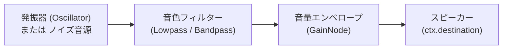

# 🔊 Web Audio API によるリアルタイム音響合成 (Audio Synthesis)

音声ファイル（mp3/wav）を一切使わずに、ブラウザ上でリアルタイムにバスケットボールの効果音を作り出す仕組みを解説します。

---

## 1. Web Audio API の基本構成 (Audio Graph)

音声合成は、**「音を出す機械（Oscillator/BufferSource）」** $\rightarrow$ **「音色を変えるフィルター（BiquadFilter）」** $\rightarrow$ **「音量を調節するアンプ（Gain）」** $\rightarrow$ **「スピーカー（Destination）」** という回路をプログラム上で接続して行います。

---

## 2. 各効果音の合成レシピ (`src/audio.js`)

### ① ドリブルのバウンド音 (`playBounce`)
* **音源:** サイン波（Sine Wave）
* **仕組み:** 周波数を一瞬で $140\text{Hz}$（低音）から $35\text{Hz}$（超低音）へと指数関数的に急降下させ、木製フローリングに重いゴムボールが当たったときの共鳴をローパスフィルターで再現。

### ② バッシュのスキーク摩擦音 (`playSqueak`)
* **音源:** 三角波（Triangle Wave）
* **仕組み:** 高周波帯（$1600\text{Hz} \sim 2400\text{Hz}$）をミリ秒単位で急激に変調させ、床とのゴムソールの摩擦鳴きを表現。

### ③ ネット通過のスウィッシュ音 (`playSwish`)
* **音源:** ホワイトノイズ（ランダム数値の配列）
* **仕組み:** ホワイトノイズを $3200\text{Hz} \rightarrow 1400\text{Hz}$ のバンドパスフィルターに通すことで、紐が擦れ合う「シュッ」という爽快な風切り音を生成。

### ④ グリーンリリース成功チャイム (`playGreenChime`)
* **音源:** 4つのサイン波オシレーター
* **仕組み:** 音楽的な和音（D5: $587\text{Hz}$, A5: $880\text{Hz}$, D6: $1174\text{Hz}$, A6: $1760\text{Hz}$）を $0.03$ 秒ずつずらして分散再生（アルペジオ）し、ゲーム的な達成感を演出。
