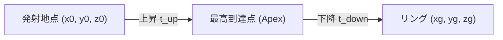

# 📐 放物線シュートの物理と数式 (Physics & Shooting Math)

ゲーム内でバスケットボールが美しいアーチを描いてゴールへ向かう「放物線（Projectile Motion）」の計算式を解説します。

---

## 1. 斜方投射の基礎物理

放物線運動は、**「水平方向の等速直線運動」** と **「鉛直方向の等加速度直線運動（重力運動）」** に分解して計算できます。

### ① 頂点（Apex）を基準にした時間の算出

最高点の高さを $y_{\text{peak}}$、重力加速度を $g$ ($g = -18.5 \text{ m/s}^2$) と置きます。

1. **発射地点から頂点までの上昇時間 $t_{\text{up}}$:**
   $$t_{\text{up}} = \sqrt{\frac{2(y_{\text{peak}} - y_0)}{-g}}$$

2. **頂点からリングまでの下降時間 $t_{\text{down}}$:**
   $$t_{\text{down}} = \sqrt{\frac{2(y_{\text{peak}} - y_{\text{target}})}{-g}}$$

3. **ボールが空中を飛ぶ合計時間 $t_{\text{total}}$:**
   $$t_{\text{total}} = t_{\text{up}} + t_{\text{down}}$$

---

## 2. 初速度ベクトル $(v_x, v_y, v_z)$ の決定

ボールを目標地点へ正確に届かせるための初速度成分は、以下のように求められます：

* **鉛直方向初速度 $v_y$:**
  $$v_y = -g \cdot t_{\text{up}}$$
* **X軸方向初速度 $v_x$:**
  $$v_x = \frac{x_{\text{target}} - x_0}{t_{\text{total}}}$$
* **Z軸方向初速度 $v_z$:**
  $$v_z = \frac{z_{\text{target}} - z_0}{t_{\text{total}}}$$

---

## 3. グリーンリリース（ブレの付与）

* **完璧なタイミング（Green）:**
  目標座標 $(x_{\text{target}}, y_{\text{target}}, z_{\text{target}})$ はリングの中心そのものとなり、100% スウィッシュ（ネット通過）します。
* **少し早い / 遅いリリース:**
  タイミングのズレ幅に応じて、ランダムな微小誤差 $(\Delta x, \Delta z)$ を目標座標に加算します。これにより、ボールがリングの縁に当たって弾かれるリアルなバウンドが発生します。
