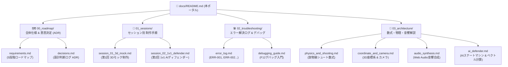

# 🏀 HOOPS 3D 開発ナレッジ & 学習ポータル

本ポータルは、スマホ向け本格3Dバスケットボールゲーム『HOOPS 3D』の制作プロセスを、プログラミング教室の生徒さんが体系的に追体験・学習できるようにまとめたドキュメントハブです。

---

## 📚 ドキュメント構成マップ



---

## 📑 ドキュメント目次

### 1. [00_roadmap (全体仕様 & 意思決定)](./00_roadmap/)
* **[requirements.md](./00_roadmap/requirements.md)**: 最終形から逆算した難易度別5段階の要件定義書。
* **[decisions.md](./00_roadmap/decisions.md)**: **【重要】設計判断ログ (ADR)**。なぜ Three.js を選んだか、なぜマルチエントリー独立スナップショットを採用したかの決定理由。
* **[dashboard_evolution.md](./00_roadmap/dashboard_evolution.md)**: **【学習システム発展記録】** 学習ダッシュボードと教材UIが段階的にどう発展したかの軌跡。

### 2. [01_sessions (セッション別 制作手順)](./01_sessions/)
* **[session_01_3d_mock.md](./01_sessions/session_01_3d_mock.md)**: 第1回「3Dコート・物理・シュートメーター・初期モック」の作成手順。
* **[session_02_1v1_defender.md](./01_sessions/session_02_1v1_defender.md)**: 第2回「1v1 AIディフェンダー・コンテスト＆ブロック判定」の作成手順。
* **[template.md](./01_sessions/template.md)**: 今後のセッション用フォーマット。

### 3. [02_troubleshooting (エラー解決 & デバッグ)](./02_troubleshooting/)
* **[error_log.md](./02_troubleshooting/error_log.md)**: 発生したエラー（ERR-001, ERR-002）と修正内容、生徒への学び。
* **[debugging_guide.md](./02_troubleshooting/debugging_guide.md)**: ブラウザ開発者ツールを使ったデバッグ実践ガイド。

### 4. [03_architecture (数学・物理・仕組みの解説)](./03_architecture/)
* **[ai_defender.md](./03_architecture/ai_defender.md)**: AIディフェンスの幾何ベクトル演算・ステートマシン・コンテスト判定。
* **[physics_and_shooting.md](./03_architecture/physics_and_shooting.md)**: 斜方投射と放物線シュートの数学・物理公式。
* **[coordinate_and_camera.md](./03_architecture/coordinate_and_camera.md)**: 3D右手座標系と3種類のカメラワーク（Broadcast / Follow / High）。
* **[audio_synthesis.md](./03_architecture/audio_synthesis.md)**: Web Audio API によるリアルタイム音響合成の仕組み。

---

## 🎮 フェーズ別スナップショット (`phases/`) とポータル起動
本ゲームは各フェーズが独立して保管されており、過去のバージョンをいつでも体験・比較できます。

```bash
# games/01_hoops_3d/ ディレクトリ内で実行
npm run dev

# ブラウザでアクセス: http://localhost:5173/
# ポータル画面から Phase 1 (ソロ練習) / Phase 2 (1v1対戦) をワンクリック起動できます
```
