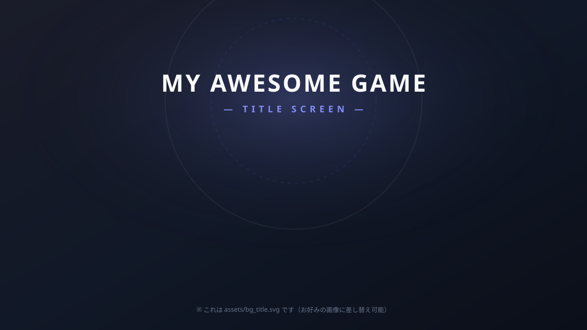

# 01: 背景画像にボタン画像を載せて画面遷移する

ゲームの「タイトル画面」や「メニュー画面」で最もよく使われる、**背景画像の上にボタン画像を重ねて配置し、クリックすると次の画面へ切り替える**コードです。

---

## 🎯 このスクリプトで学べること

1. **画像を重ねて配置するCSSテクニック**（`position: relative` と `position: absolute`）
2. **ボタンの押し心地をつくる演出**（マウスホバーで少し拡大、クリックで縮小）
3. **ゲームとWebで使い分ける2つの画面遷移方式**
   - **方式A（ゲーム向き）**: 同一ページ内で画面をフェード切り替え（BGMやゲーム変数がリセットされない）
   - **方式B（Web向き）**: 別のHTMLファイルへ遷移（`window.location.href`）

---

## 📁 フォルダとファイルの役割

```text
snippets/01_button_screen_transition/
├── index.html          # メインのHTML（タイトル画面・次画面の構造）
├── style.css           # 背景やボタンの重なり・位置・動きのスタイル
├── main.js             # クリック検知・効果音・画面切り替えのJavaScript
├── next_page.html      # 方式B（別ページ遷移）の遷移先ページ
├── README.md           # この解説ドキュメント
└── assets/             # サンプル画像ファイル
    ├── bg_title.svg    # タイトル画面背景
    ├── bg_game.svg     # 次画面背景
    ├── btn_start.svg   # スタートボタン画像
    └── btn_back.svg    # 戻るボタン画像
```

---

## 💡 仕組みの解説

### 1. 背景の上にボタンを置く仕組み (HTML & CSS)

背景画像とボタン画像を重ねるには、**親の枠を基準（relative）にして、子要素を自由な位置（absolute）に配置**します。

```html
<!-- 親枠：16:9のゲーム画面 -->
<div class="game-container">
  <!-- 背景画像（枠いっぱいに広げる） -->
  

  <!-- ボタン画像（位置を指定して重ねる） -->
  <button class="image-button" id="btn-start-wrapper">
    
  </button>
</div>
```

```css
/* 親コンテナ：配置の基準点にする */
.game-container {
  position: relative;
  aspect-ratio: 16 / 9;
}

/* 背景画像：左上から全体を覆う */
.screen-bg {
  position: absolute;
  top: 0;
  left: 0;
  width: 100%;
  height: 100%;
  object-fit: cover;
}

/* ボタン画像：中央下の位置に配置 */
#btn-start-wrapper {
  position: absolute;
  bottom: 18%;           /* 下から18%の位置 */
  left: 50%;             /* 左から50%（画面中央） */
  transform: translateX(-50%); /* ボタン自体の中心を合わせる */
}
```

---

### 2. 画面遷移の仕組み (JavaScript)

#### 方式A：同一ページ内での切り替え（ゲーム開発に最適）
ゲームでは「BGMを鳴らし続けたい」「ロード時間をなくしたい」ため、HTML内に両方の画面を用意しておき、`.active` クラスを付け替えて表示/非表示を切り替えます。

```javascript
// タイトル画面を消して、ゲーム画面を出す
screenTitle.classList.remove('active');
screenGame.classList.add('active');
```

#### 方式B：別HTMLページへの移動
Webサイトのように完全に新しいページへ移動したい場合は、`window.location.href` を書き換えます。

```javascript
// next_page.html へページ遷移する
window.location.href = './next_page.html';
```

---

## 🎨 自分の好きな画像に差し替える方法

自分の描いたイラストやフリー素材（PNGやJPG）を使いたいときは、以下の手順で差し替えます。

1. 用意した画像を `assets/` フォルダの中に保存します（例: `my_title.png`, `my_button.png`）。
2. `index.html` の `src="..."` のパスを書き換えます。

```html
<!-- 変更前 -->

<button class="image-button" id="btn-start-wrapper">
  
</button>

<!-- 変更後（自分の画像ファイル名にする） -->

<button class="image-button" id="btn-start-wrapper">
  
</button>
```

> **💡 画像パスのルール**:
> 必ず `./assets/画像名` のように `./`（相対パス）から書き始めましょう。WindowsでもMacでも正しく表示されます。
